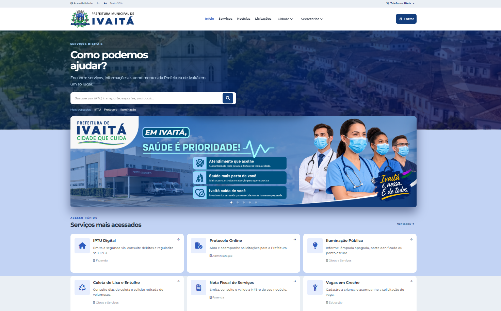
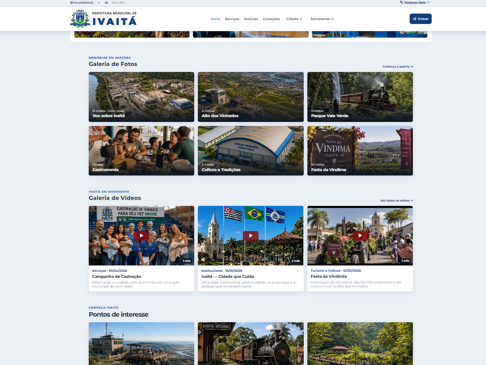
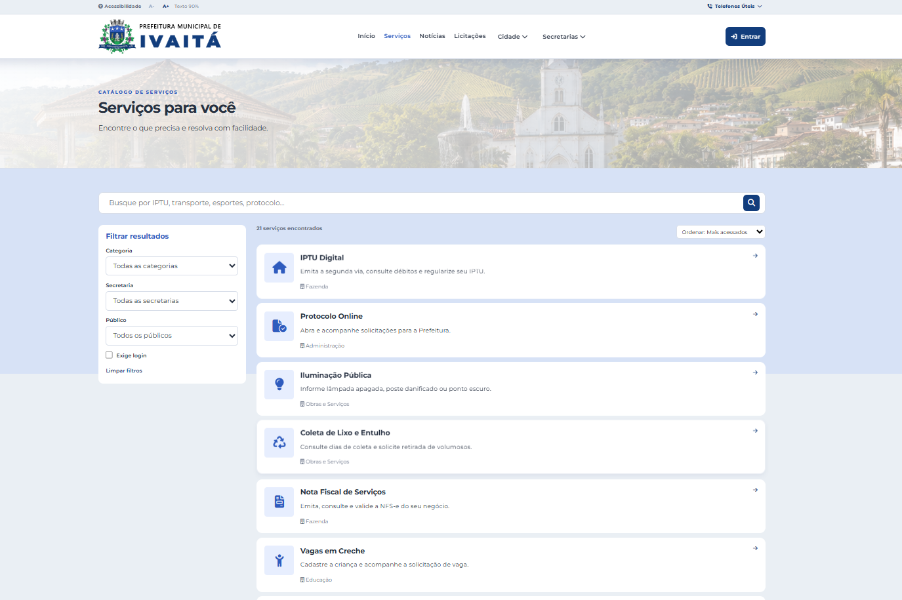
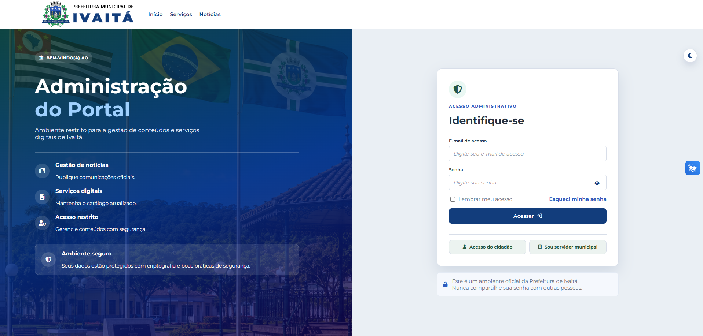

<p align="center">
  
</p>

<h1 align="center">Ivaitá — SP</h1>

<p align="center">
  <strong>Uma cidade fictícia. Um universo completo.</strong>
</p>

<p align="center">
  Worldbuilding · Identidade Visual · Storytelling · Comunicação · Audiovisual · UX/UI · Desenvolvimento
</p>

<p align="center">
  <a href="https://ivaita-portal.pages.dev/"><strong>🌐 Explorar a Plataforma Digital</strong></a>
</p>

---

## 🏙️ O Projeto Ivaitá

**Ivaitá-SP** é um município fictício do interior de São Paulo desenvolvido como um projeto multidisciplinar de **worldbuilding, identidade visual, storytelling, comunicação, audiovisual, UX/UI e desenvolvimento de software**.

A proposta parte de uma pergunta:

> **Até onde é possível construir uma cidade que não existe e, ainda assim, fazê-la possuir a coerência histórica, visual, cultural, institucional e digital de um município real?**

Ivaitá não foi criada apenas como cenário para um site fictício. Possui território, história, população, bairros, distritos, patrimônio, símbolos, arquitetura, tradições, festas, serviços públicos, paisagens, comunicação institucional e produtos digitais próprios.

Cada uma dessas partes pertence ao mesmo universo e segue um **cânone**, permitindo que uma decisão tomada na história ou na geografia da cidade também seja respeitada em fotografias, mapas, vídeos, campanhas, interfaces e serviços digitais.

---

## ✦ Um município construído em várias camadas

| Área | O que é desenvolvido | Documentação |
| --- | --- | --- |
| 🌎 **Worldbuilding** | História, território, bairros, distritos, personagens, patrimônio, acontecimentos e memória coletiva  |
| 🎨 **Identidade Visual** | Brasão, bandeira, cores, tipografia, símbolos, design system e aplicações institucionais |
| 📖 **Storytelling** | Tradições, famílias, acontecimentos históricos, cultura e narrativas do município | 
| 📢 **Comunicação** | Campanhas públicas, notícias, cartazes, publicidade, eventos e materiais institucionais | 
| 📷 **Direção de Arte** | Arquitetura, paisagens, fotografia, representação urbana e continuidade visual | 
| 🎬 **Audiovisual** | Vídeos institucionais, turismo, campanhas, registros fictícios e peças para redes sociais | 
| 🧭 **Turismo & Cultura** | Patrimônio, natureza, ferrovia histórica, festas, gastronomia e roteiros | 
| 💻 **Produtos Digitais** | Portal público, Área do Servidor, administração, serviços, turismo e experiências digitais |

---

## 🌎 Worldbuilding

Ivaitá é construída como uma cidade com **passado, presente e continuidade**. História, território, bairros, patrimônio, ferrovia, agricultura, personagens, tradições, turismo e desenvolvimento urbano fazem parte de um mesmo cânone.

### Continuidade é uma regra do projeto

Cada elemento consolidado passa a orientar as próximas criações:

```text
MAPA → define onde
FOTOGRAFIA → define como
STORYTELLING → define história e significado
COMUNICAÇÃO → transforma em conteúdo
PLATAFORMA DIGITAL → conecta o universo
```

Assim, lugares, edifícios e tradições podem aparecer em diferentes mídias preservando sua identidade.

---

## 🎨 Identidade Visual

Ivaitá possui uma identidade municipal própria, composta por **brasão, bandeira, símbolos, cores, tipografia, iconografia, design system e identidades institucionais e turísticas**.

Elementos aprovados passam a integrar o cânone visual e são preservados nas diferentes aplicações do município.

---

## 📷 Construção Visual

Mapas, fotografias e direção de arte dão forma física à cidade, incluindo regiões como **Centro Histórico, Sede Nova, Nova Ivaitá, Alto dos Vinhedos, Centro Logístico Rio Itararé e Parque Vale Verde**.

> **Mapa define onde. Fotografia define como.**

Uma referência visual consolidada orienta futuras representações, mantendo coerência entre arquitetura, paisagem, geografia e infraestrutura.

---

## 📖 Cultura & Tradições

As manifestações culturais recebem história, calendário, símbolos e representação visual próprios.

A **Festa da Vindima**, por exemplo, conecta os vinhedos, famílias produtoras, gastronomia, tradições rurais, ferrovia turística e Parque Vale Verde em uma celebração pertencente ao universo de Ivaitá.

Esses elementos podem depois aparecer em notícias, campanhas, fotografias, vídeos e na própria plataforma digital.

---

## 📢 Comunicação & Publicidade

O projeto simula também a comunicação de um município real, produzindo **campanhas institucionais, notícias, utilidade pública, eventos, turismo, cultura e conteúdo para redes sociais**.

A comunicação procura manter uma linguagem municipal brasileira plausível sem perder a personalidade própria de Ivaitá.

---

## 🎬 Fotografia & Audiovisual

Fotografia, vídeo e animação expandem visualmente o universo por meio de **paisagens, registros documentais fictícios, campanhas, eventos e produções turísticas e institucionais**.

Ferramentas tradicionais e **IA generativa** fazem parte do processo, sempre sob direção e curadoria para preservar o cânone e a continuidade visual.

---
# 💻 Plataforma Digital de Ivaitá

A **Plataforma Digital de Ivaitá** é a manifestação digital desse universo.

O protótipo navegável simula o ecossistema digital municipal, integrando identidade visual, UX/UI, conteúdo institucional e experiências de serviços públicos. Este repositório apresenta e documenta seu desenvolvimento.

<p align="center">
  <a href="https://ivaita-portal.pages.dev/">
    <strong>🌐 ACESSAR O PROTÓTIPO ONLINE</strong>
  </a>
</p>

<p align="center">
  <code>https://ivaita-portal.pages.dev/</code>
</p>

---

A demonstração reúne três ambientes principais:

| Ambiente | Experiência |
| --- | --- |
| 🏛️ **Portal Público** | Serviços, notícias, eventos, Diário Oficial, secretarias, turismo, galerias e conteúdos institucionais |
| 👤 **Área do Servidor** | Simulação de dados funcionais, REs, ponto, holerites, documentos e solicitações |
| ⚙️ **Painel Administrativo** | Gestão simulada dos conteúdos apresentados no Portal Público |

---

## 🔐 Simulações da Área do Servidor

Use a opção **Sou servidor municipal** na tela de login.

| Cenário | Usuário | Senha | Dados simulados |
| --- | --- | --- | --- |
| Professora com dois REs | `ana.prof` | `ivaita123` | RE 01245 e RE 08421; possui uma falta abonada e uma abonada de aniversário recentes. |
| Servidor com um RE | `carlos.silva` | `ivaita123` | RE 03917; não possui avisos ou solicitações registrados. |
| Efetiva em cargo de comissão | `renata.gomes` | `ivaita123` | RE 06390; cargo efetivo, cargo em comissão e vários pedidos registrados nos últimos 30 dias. |

---

## ⚙️ Simulações da Área Administrativa

Use a opção **Acesso administrativo** na tela de login e informe uma das credenciais demonstrativas abaixo.

| Perfil | Login | Senha |
| --- | --- | --- |
| Administrador Geral | `Admin` | `Admin123` |
| Comunicação | `joao.ferreira@ivaita.sp.gov.br` | `Joao123` |
| Usuário padrão | `beatriz.campos@ivaita.sp.gov.br` | `Beatriz123` |

> 🔓 **Ambiente demonstrativo:** todas as credenciais acima são públicas e fictícias. Elas existem exclusivamente para permitir a exploração das funcionalidades do protótipo e não correspondem a contas ou sistemas reais.


## 🔄 Experimente administrar a cidade

O **Painel Administrativo e o Portal Público estão integrados dentro da demonstração**.

Experimente acessar o Admin e realizar ações como criar, editar, publicar, desativar ou organizar um conteúdo. Depois, retorne ao Portal Público para visualizar o resultado da alteração.

```text
PAINEL ADMINISTRATIVO
        ↓
criar / editar / publicar
        ↓
PERSISTÊNCIA LOCAL
        ↓
PORTAL PÚBLICO
        ↓
conteúdo atualizado
```

As alterações possuem **persistência no navegador**: elas continuam disponíveis mesmo após atualizar ou fechar e reabrir a página no mesmo navegador.

Por se tratar de um protótipo demonstrativo, essa persistência é local. Portanto, alterações realizadas por um visitante **não modificam a experiência de outros usuários ou dispositivos**.

Isso permite experimentar livremente os recursos administrativos sem alterar a versão pública original para outras pessoas.

---

## 📸 Screenshots

<p align="center">
  
  
</p>

<p align="center">
  
  
</p>

---

## ☁️ Demonstração online

A versão pública do protótipo está hospedada no **Cloudflare Pages**.

**https://ivaita-portal.pages.dev/**

---

## 🧰 Processo criativo e ferramentas

O universo de Ivaitá é desenvolvido por meio de um processo híbrido que combina **direção criativa, design tradicional, desenvolvimento de software e inteligência artificial generativa**.

A IA generativa é utilizada como uma das ferramentas do processo para explorar e produzir conceitos visuais, imagens, cenas, materiais audiovisuais, textos, storytelling, worldbuilding e apoio ao desenvolvimento.

Esses materiais passam por um processo de **direção, seleção, curadoria, edição, composição e continuidade**, buscando preservar o cânone e a identidade estabelecida para o município.

Ferramentas tradicionais de design, edição e desenvolvimento também fazem parte do fluxo de produção.

### Ferramentas utilizadas

| Área | Ferramentas |
| --- | --- |
| 🎨 Design e identidade visual | Adobe Illustrator, Adobe Photoshop e Figma |
| 🎬 Edição e produção audiovisual | Movavi Video Editor |
| 💻 Desenvolvimento | Visual Studio Code |
| ✨ Criação generativa | Ferramentas de IA generativa para texto, imagem, vídeo, áudio e apoio ao desenvolvimento |
| 🌐 Publicação | GitHub e Cloudflare Pages |

### Fluxo de criação

```text
Pesquisa e conceito
        ↓
Worldbuilding e cânone
        ↓
Direção criativa
        ↓
Design + IA generativa
        ↓
Seleção e curadoria
        ↓
Edição e acabamento
        ↓
Aplicação em comunicação / audiovisual / software
        ↓
Integração ao universo de Ivaitá
```

---

## ⚠️ Sobre o projeto

**Ivaitá-SP é uma criação fictícia.**

Nomes de órgãos municipais, serviços, notícias, eventos, documentos, personagens, endereços institucionais, credenciais e demais informações apresentadas neste projeto fazem parte de uma simulação ou do universo ficcional de Ivaitá.

O conteúdo não deve ser interpretado como informação oficial de qualquer município real.

O código-fonte da aplicação não faz parte da versão pública deste projeto. Este repositório funciona como **apresentação, documentação e registro do processo de construção do universo de Ivaitá**.

---

<p align="center">
  <strong>Ivaitá — SP</strong><br>
  Uma cidade fictícia. Um universo em construção.
</p>

<p align="center">
  <a href="https://ivaita-portal.pages.dev/"><strong>🌐 Explorar a Plataforma Digital</strong></a>
</p>
