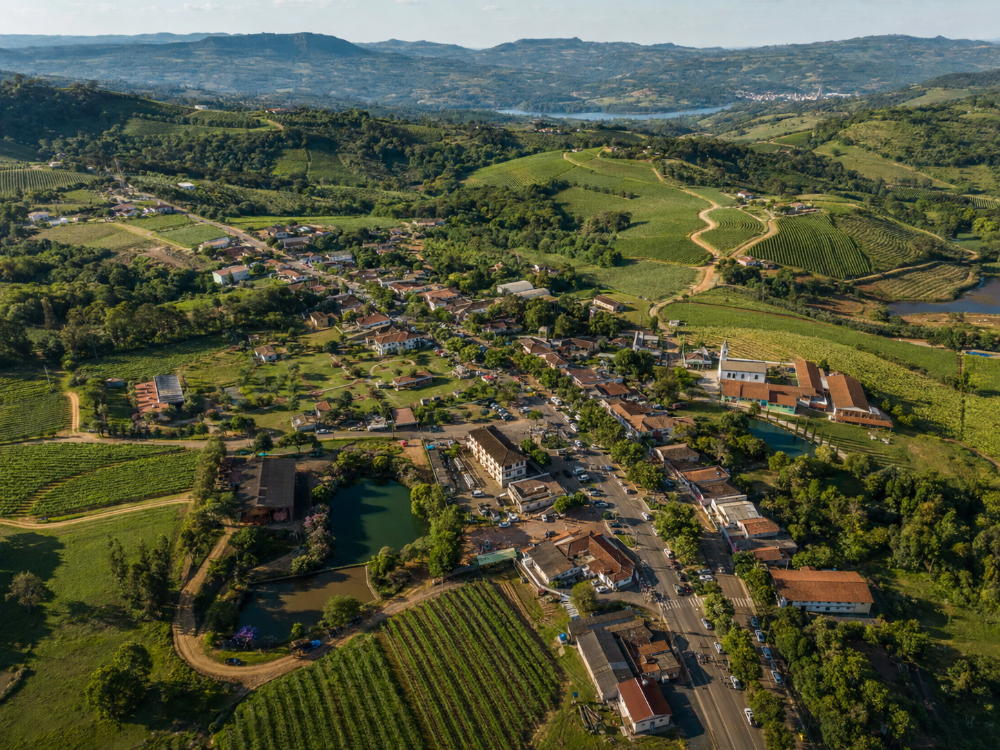
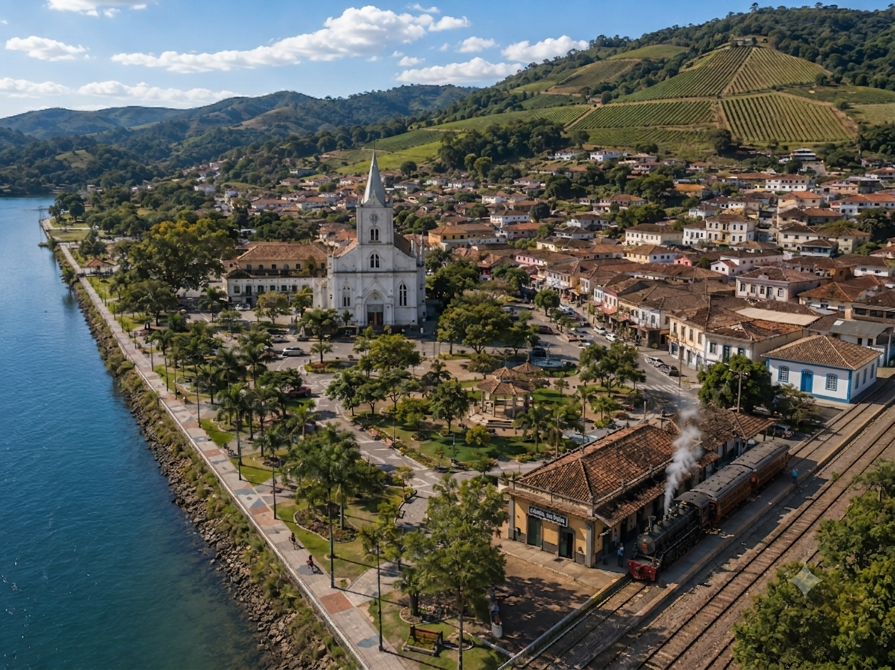
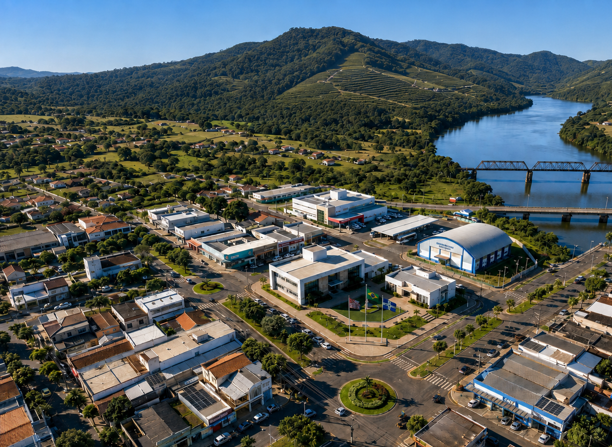
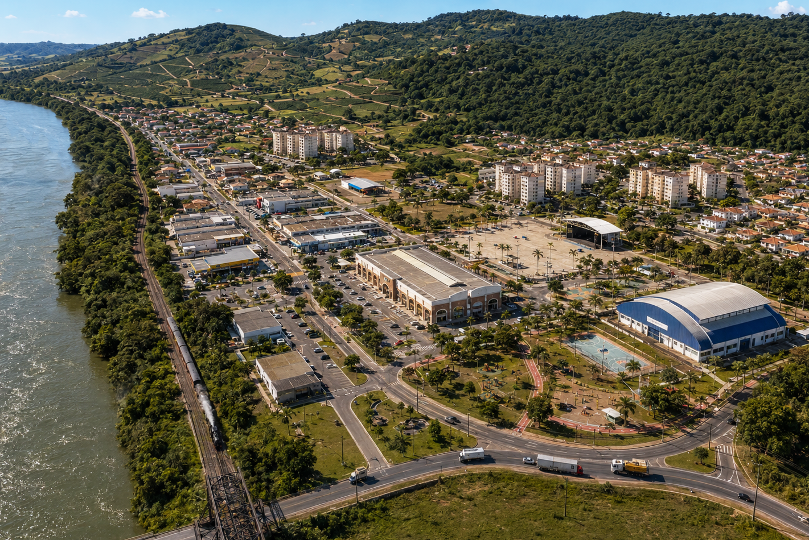
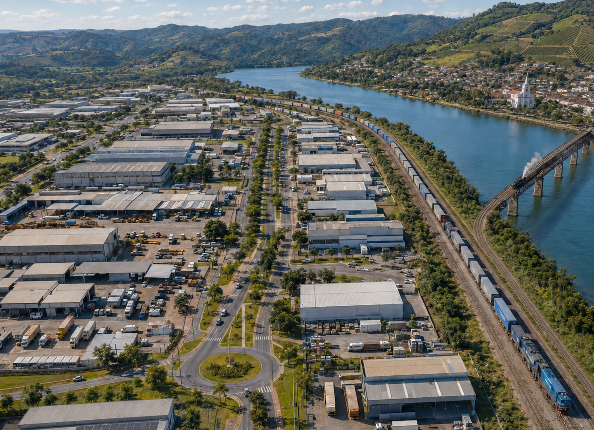
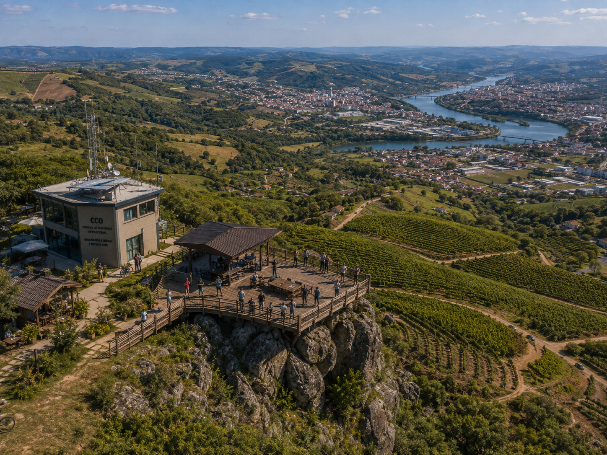
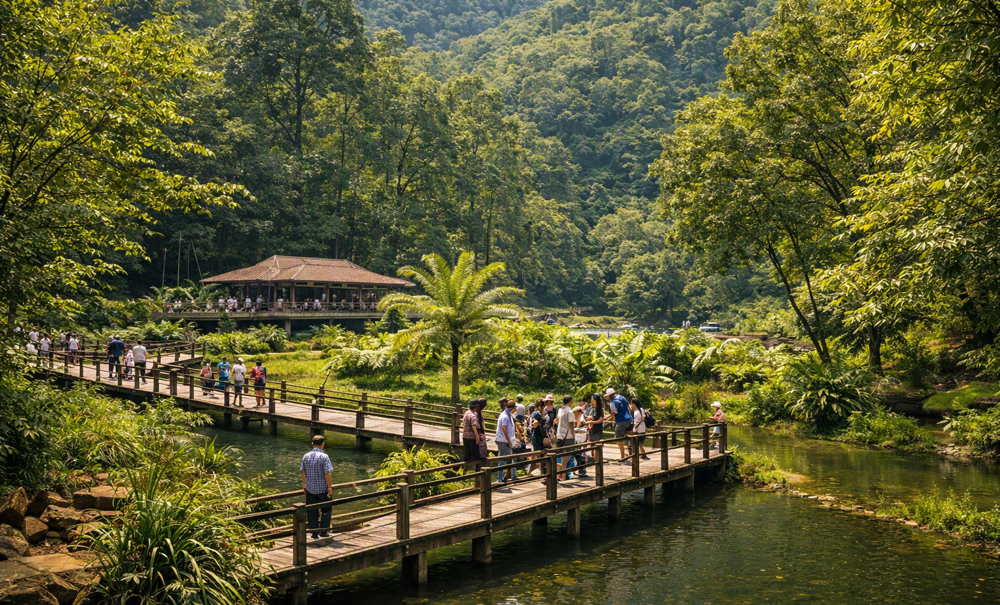
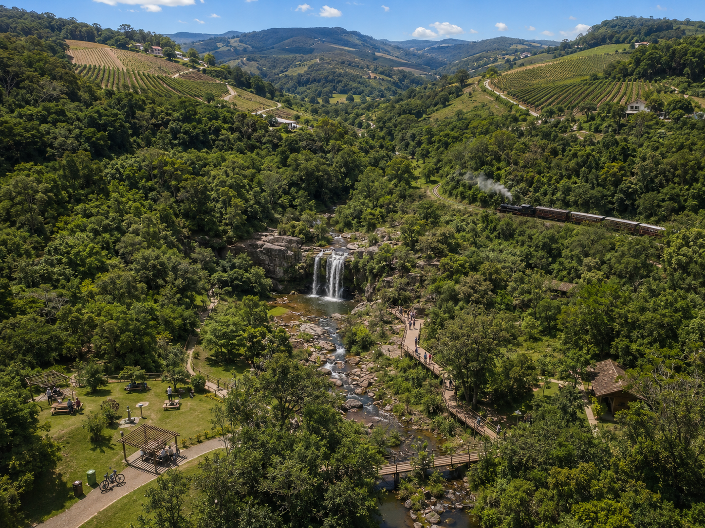

# 🗺️ Bairros, Distritos & Paisagens de Ivaitá — SP

<p align="center">
  <strong>Território, arquitetura e paisagem na construção visual de Ivaitá.</strong>
</p>

Esta coleção reúne referências visuais das principais regiões, paisagens e pontos naturais de **Ivaitá-SP**.

As imagens fazem parte da construção territorial e visual do município e ajudam a estabelecer características como **arquitetura, relevo, vegetação, ocupação urbana, áreas rurais e relação entre cidade e natureza**.

> **MAPA define onde. FOTOGRAFIA define como.**

O mapa canônico determina a localização e a relação espacial entre os elementos do município.  
As imagens desta coleção ajudam a definir sua aparência.

---

## 🧭 Organização territorial

Ivaitá possui diferentes centralidades e paisagens, resultado de sua formação histórica e do desenvolvimento urbano e rural.

Entre as principais regiões representadas nesta coleção estão:

- **Centro Histórico** — núcleo original, patrimônio, comércio tradicional e memória ferroviária;
- **Sede Nova** — centralidade administrativa contemporânea;
- **Nova Ivaitá** — expansão residencial e comercial recente;
- **Alto dos Vinhedos** — serras, propriedades rurais, vinhedos, natureza e turismo;
- **Centro Logístico Rio Itararé** — logística, indústria e ferrovia cargueira.

A coleção também apresenta paisagens e atrações do Alto dos Vinhedos, como **Mirante Pedra Alta, Parque Vale Verde e seus vinhedos e trilhas**.

---

# 📷 Regiões de Ivaitá

## 🍇 Alto dos Vinhedos

<p align="center">
  <a href="alto-dos-vinhedos.png">
    
  </a>
</p>

<p align="center">
  <a href="alto-dos-vinhedos.png"><strong>🔎 Ver imagem em tamanho completo</strong></a>
</p>

Localizado ao norte do município, o **Alto dos Vinhedos** reúne algumas das paisagens mais características de Ivaitá.

Serras, propriedades rurais, estradas sinuosas, Mata Atlântica e parreirais formam uma região marcada pela **viticultura, agricultura familiar, gastronomia e turismo rural**.

É também o principal território da **Festa da Vindima de Ivaitá**.

---

## ⛪ Centro Histórico

<p align="center">
  <a href="centro-historico.png">
    
  </a>
</p>

<p align="center">
  <a href="centro-historico.png"><strong>🔎 Ver imagem em tamanho completo</strong></a>
</p>

O **Centro Histórico** corresponde ao núcleo mais antigo da cidade.

Sua paisagem reúne a **Igreja Matriz de Nossa Senhora das Graças, Praça da Matriz, casario tradicional, comércio, Estação Santa Vitória, ferrovia histórica e relação com o Rio Paranapanema**.

É o principal território da memória urbana e ferroviária de Ivaitá.

---

## 🏛️ Sede Nova

<p align="center">
  <a href="sede-nova.png">
    
  </a>
</p>

<p align="center">
  <a href="sede-nova.png"><strong>🔎 Ver imagem em tamanho completo</strong></a>
</p>

A **Sede Nova** representa a centralidade administrativa contemporânea do município.

Concentra equipamentos como **Prefeitura, Câmara Municipal, Hospital Municipal e Terminal Rodoviário da Sede Nova**, além de outros serviços públicos.

Sua formação representa a expansão administrativa de Ivaitá para além do núcleo histórico.

---

## 🏙️ Nova Ivaitá

<p align="center">
  <a href="nova-ivaita.png">
    
  </a>
</p>

<p align="center">
  <a href="nova-ivaita.png"><strong>🔎 Ver imagem em tamanho completo</strong></a>
</p>

**Nova Ivaitá** é uma das principais áreas de expansão urbana recente.

Sua paisagem é predominantemente residencial e comercial, com bairros contemporâneos, escolas, equipamentos esportivos, serviços, **Mercado Municipal** e o **Terminal Rodoviário de Nova Ivaitá**.

---

## 🚚 Centro Logístico Rio Itararé

<p align="center">
  <a href="distrito-logistico.png">
    
  </a>
</p>

<p align="center">
  <a href="distrito-logistico.png"><strong>🔎 Ver imagem em tamanho completo</strong></a>
</p>

Localizado ao sul/sudoeste, o **Centro Logístico Rio Itararé** concentra atividades industriais, armazenagem, distribuição e infraestrutura ferroviária de cargas.

A região possui relação direta com a **ferrovia cargueira moderna**, distinta da ferrovia histórica e turística da Locomotiva nº 42.

> **Importante:** “Rio Itararé” é o nome histórico do distrito/centro logístico. Não corresponde a um rio que atravesse Ivaitá.

---

# 🌿 Paisagens & Turismo

## ⛰️ Mirante Pedra Alta

<p align="center">
  <a href="mirante-da-pedra-alta.png">
    
  </a>
</p>

<p align="center">
  <a href="mirante-da-pedra-alta.png"><strong>🔎 Ver imagem em tamanho completo</strong></a>
</p>

O **Mirante Pedra Alta** está localizado na região do Alto dos Vinhedos.

A altitude e o relevo permitem vistas amplas sobre **vinhedos, vales, áreas de Mata Atlântica, Rio Paranapanema e a cidade de Ivaitá**.

O local integra o conjunto de experiências de natureza e contemplação do município.

---

## 🥾 Trilha do Vale Verde

<p align="center">
  <a href="trilha-vale-verde.png">
    
  </a>
</p>

<p align="center">
  <a href="trilha-vale-verde.png"><strong>🔎 Ver imagem em tamanho completo</strong></a>
</p>

As trilhas do **Parque Vale Verde** percorrem áreas de Mata Atlântica, cursos d'água e paisagens serranas do Alto dos Vinhedos.

O parque combina **ecoturismo, contemplação, educação ambiental e conservação**, com trilhas, passarelas, córregos e cachoeira.

---

## 🍃 Vinhedos do Vale Verde

<p align="center">
  <a href="vinhedos-vale-verde.png">
    
  </a>
</p>

<p align="center">
  <a href="vinhedos-vale-verde.png"><strong>🔎 Ver imagem em tamanho completo</strong></a>
</p>

Os vinhedos próximos ao **Parque Vale Verde** representam o encontro entre agricultura e paisagem natural que caracteriza o Alto dos Vinhedos.

A região combina propriedades rurais, parreirais, serras e remanescentes de Mata Atlântica, formando uma das principais paisagens turísticas de Ivaitá.

---

# 🧩 Continuidade visual

Estas imagens funcionam como referências para novas representações do município.

Quando um lugar já estabelecido aparecer novamente em fotografias, vídeos, campanhas ou outras peças visuais, devem ser preservados seus principais elementos:

```text
GEOGRAFIA
    ↓
RELEVO
    ↓
ARQUITETURA
    ↓
VEGETAÇÃO
    ↓
INFRAESTRUTURA
    ↓
IDENTIDADE DO LUGAR
```

Novos enquadramentos podem apresentar diferentes pontos de vista, horários, condições climáticas e situações cotidianas sem transformar arbitrariamente a identidade do ambiente.

---

## 🚆 Atenção às ferrovias

Ivaitá possui **dois sistemas ferroviários distintos**.

| Ferrovia | Característica |
| --- | --- |
| 🚂 **Histórica / turística** | Bitola estreita de 60 cm, Estação Santa Vitória e Locomotiva nº 42 |
| 🚆 **Cargueira moderna** | Transporte de cargas e conexão com o Centro Logístico Rio Itararé |

Seus percursos, funções, equipamentos e características visuais não devem ser confundidos.

---

## ⚠️ Sobre as imagens

**Ivaitá-SP é uma cidade fictícia.**

As imagens desta coleção fazem parte de um projeto de **worldbuilding, direção de arte, identidade visual e construção territorial**.

Elas representam locais pertencentes ao universo ficcional de Ivaitá e não devem ser interpretadas como registros de um município real.

---

<p align="center">
  <strong>Ivaitá — SP</strong><br>
  Um território fictício construído com continuidade.
</p>

<p align="center">
  <a href="../README.md"><strong>← Voltar ao Projeto Ivaitá</strong></a>
  &nbsp;·&nbsp;
  <a href="https://ivaita-portal.pages.dev/"><strong>🌐 Plataforma Digital</strong></a>
</p>
