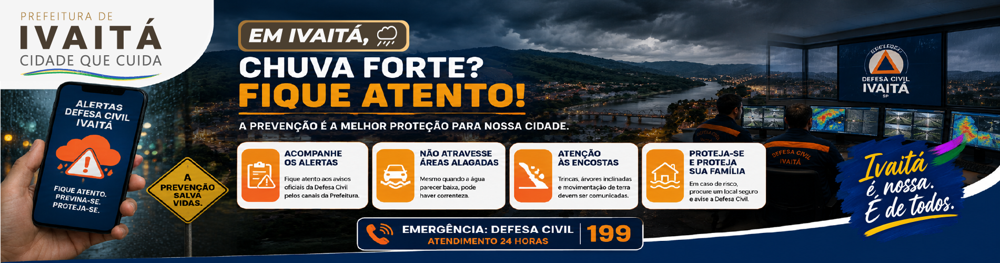
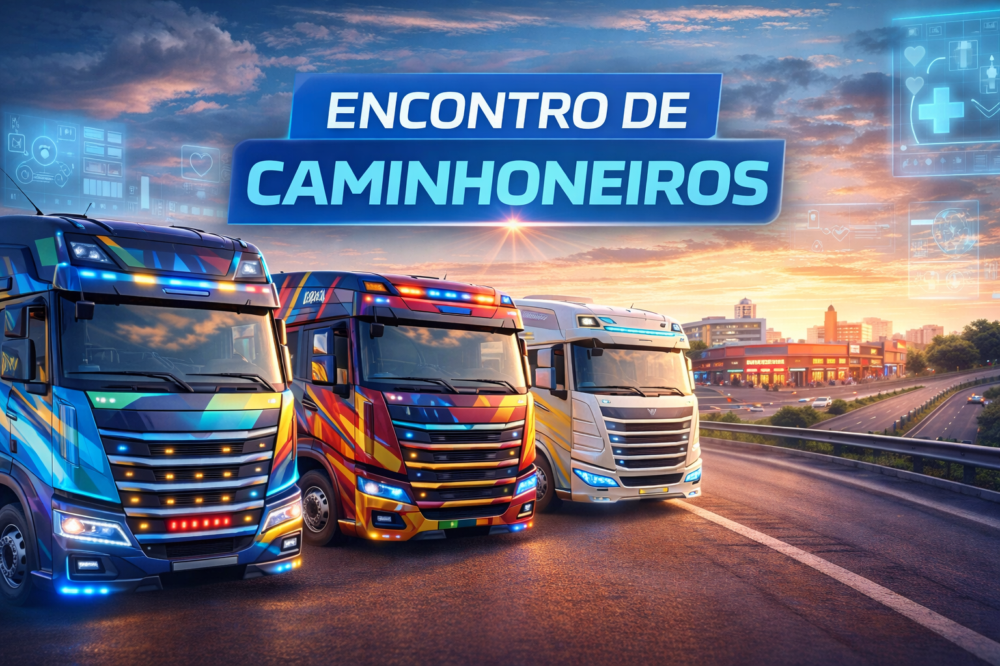
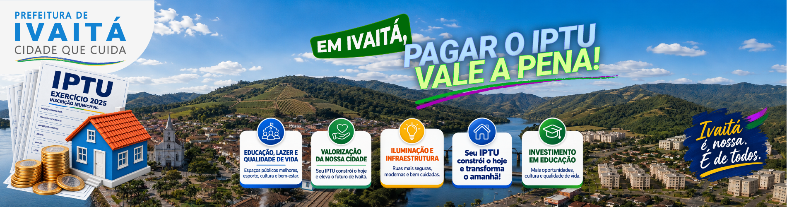
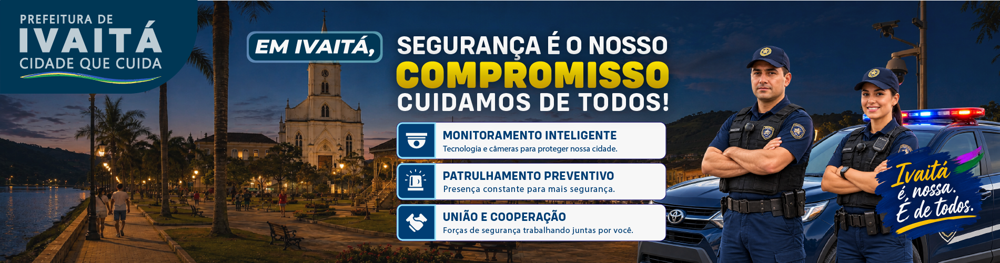

# 📢 Campanhas de Ivaitá — SP

<p align="center">
  <strong>Comunicação pública como parte da identidade de uma cidade fictícia.</strong>
</p>

As campanhas institucionais de **Ivaitá-SP** exploram como a identidade visual e a linguagem de um município podem se desdobrar em situações reais de comunicação pública.

Mais do que peças isoladas, as campanhas fazem parte do universo de Ivaitá e simulam a atuação cotidiana de uma prefeitura: informar, orientar, conscientizar, prestar contas e aproximar os serviços municipais da população.

---

## 🏛️ Comunicação institucional

A comunicação da Prefeitura de Ivaitá procura seguir a lógica de uma cidade brasileira de pequeno/médio porte, conciliando:

- identidade institucional;
- clareza da informação;
- hierarquia visual;
- linguagem acessível;
- reconhecimento imediato do emissor;
- consistência entre diferentes secretarias e serviços;
- adaptação para meios digitais e impressos.

As peças podem assumir linguagens diferentes conforme o assunto, mas permanecem visualmente relacionadas ao mesmo município.

---

## 🎨 Direção visual

As campanhas utilizam elementos derivados da identidade visual de Ivaitá, incluindo **cores institucionais, brasão, tipografia, composição gráfica e sistemas auxiliares de comunicação**.

O objetivo não é fazer todas as campanhas parecerem idênticas.

A identidade funciona como um sistema capaz de acomodar diferentes contextos — saúde, segurança, meio ambiente, defesa civil, tributos ou comunicação institucional — preservando reconhecimento e coerência.

```text
IDENTIDADE MUNICIPAL
        ↓
TEMA DA CAMPANHA
        ↓
DIREÇÃO DE ARTE
        ↓
MENSAGEM
        ↓
PEÇA DE COMUNICAÇÃO
        ↓
CIDADÃO
```

---

# 🖼️ Campanhas desenvolvidas

## 🌧️ Alerta de Chuvas

<p align="center">
  
</p>

Peça de **utilidade pública e prevenção**, voltada à comunicação de situações meteorológicas que possam representar risco para a população.

A temática possui relação especial com a memória urbana de Ivaitá, marcada pelas grandes chuvas de **1987**, que influenciaram posteriormente políticas de drenagem, ocupação de encostas e prevenção de riscos.

---

## 🚛 Comunicação de Serviços Municipais

<p align="center">
  
</p>

Aplicação da comunicação institucional relacionada à infraestrutura e aos serviços operacionais do município.

Esse tipo de peça ajuda a expandir a identidade de Ivaitá para além de edifícios e portais digitais, mostrando como a marca municipal aparece também na prestação cotidiana dos serviços públicos.

---

## 🧾 IPTU — Vale a Pena

<p align="center">
  
</p>

Campanha de comunicação tributária desenvolvida para aproximar um tema administrativo da linguagem cotidiana do cidadão.

A proposta trabalha o IPTU como parte do funcionamento e da manutenção dos serviços municipais, buscando uma comunicação mais direta e compreensível.

---

## 🌱 Meio Ambiente

<p align="center">
  
</p>

Peça relacionada à **preservação ambiental e conscientização pública**.

O tema possui presença importante no universo de Ivaitá devido à relação do município com o **Rio Paranapanema, Mata Atlântica, serras, áreas rurais e Parque Vale Verde**.

A comunicação ambiental procura conectar responsabilidade pública e identidade territorial.

---

## ❤️ Saúde é Prioridade

<p align="center">
  
</p>

Campanha institucional voltada à comunicação das ações e serviços municipais de saúde.

A linguagem visual busca transmitir **proximidade, cuidado e confiança**, mantendo a identificação com a Prefeitura e com o sistema visual de Ivaitá.

---

## 🛡️ Segurança é Compromisso

<p align="center">
  
</p>

Peça institucional relacionada à prevenção, proteção e comunicação de ações públicas de segurança.

A direção visual procura equilibrar **autoridade institucional e proximidade com a população**, evitando uma comunicação excessivamente agressiva ou desconectada da identidade municipal.

---

# 🧩 Campanhas dentro do universo

As campanhas não existem separadamente do restante do projeto.

Informações apresentadas em uma peça podem estar relacionadas à história, geografia, serviços e acontecimentos já estabelecidos no cânone.

```text
WORLDBUILDING
        ↓
CONTEXTO MUNICIPAL
        ↓
COMUNICAÇÃO
        ↓
CAMPANHA
        ↓
DESDOBRAMENTOS
```

Uma campanha de chuvas pode dialogar com a história de 1987.

Uma campanha ambiental pode utilizar o Paranapanema ou o Parque Vale Verde.

Uma campanha de mobilidade pode utilizar os ônibus do Transporte Ivaitá.

Uma campanha cultural pode utilizar patrimônio, festas e tradições já estabelecidas.

Dessa maneira, **a comunicação também participa da construção da cidade**.

---

## 🧠 Processo criativo

As peças são desenvolvidas dentro de um processo híbrido de criação.

```text
Contexto e objetivo
        ↓
Pesquisa e conceito
        ↓
Direção criativa
        ↓
Identidade visual
        ↓
Design + recursos generativos
        ↓
Curadoria
        ↓
Edição e acabamento
        ↓
Aplicação
```

Ferramentas de design, edição e inteligência artificial generativa podem participar de diferentes etapas.

A incorporação de qualquer material ao projeto depende de **direção, seleção, composição, acabamento e coerência com o universo de Ivaitá**.

---

## 🔗 Relação com o projeto

As campanhas são apenas uma das manifestações da identidade municipal.

Elas se conectam a outras áreas do projeto, como:

- identidade visual;
- worldbuilding;
- storytelling;
- fotografia;
- audiovisual;
- turismo;
- cultura;
- serviços públicos;
- UX/UI;
- Plataforma Digital de Ivaitá.

Essa integração permite que a mesma cidade seja reconhecida em um mapa, em um ônibus, em um cartão de transporte, em uma campanha institucional ou em uma interface digital.

---

## ⚠️ Sobre as campanhas

**Ivaitá-SP é uma cidade fictícia.**

As campanhas apresentadas nesta pasta são exercícios de **design, comunicação visual e construção de universo**.

Órgãos, programas, serviços, mensagens e demais informações apresentados fazem parte de uma simulação ou do universo ficcional de Ivaitá e não representam campanhas oficiais de qualquer município real.

---

<p align="center">
  <strong>Ivaitá — SP</strong><br>
  Comunicação que também constrói uma cidade.
</p>

<p align="center">
  <a href="../README.md"><strong>← Voltar ao Projeto Ivaitá</strong></a>
  &nbsp;·&nbsp;
  <a href="https://ivaita-portal.pages.dev/"><strong>🌐 Plataforma Digital</strong></a>
</p>
