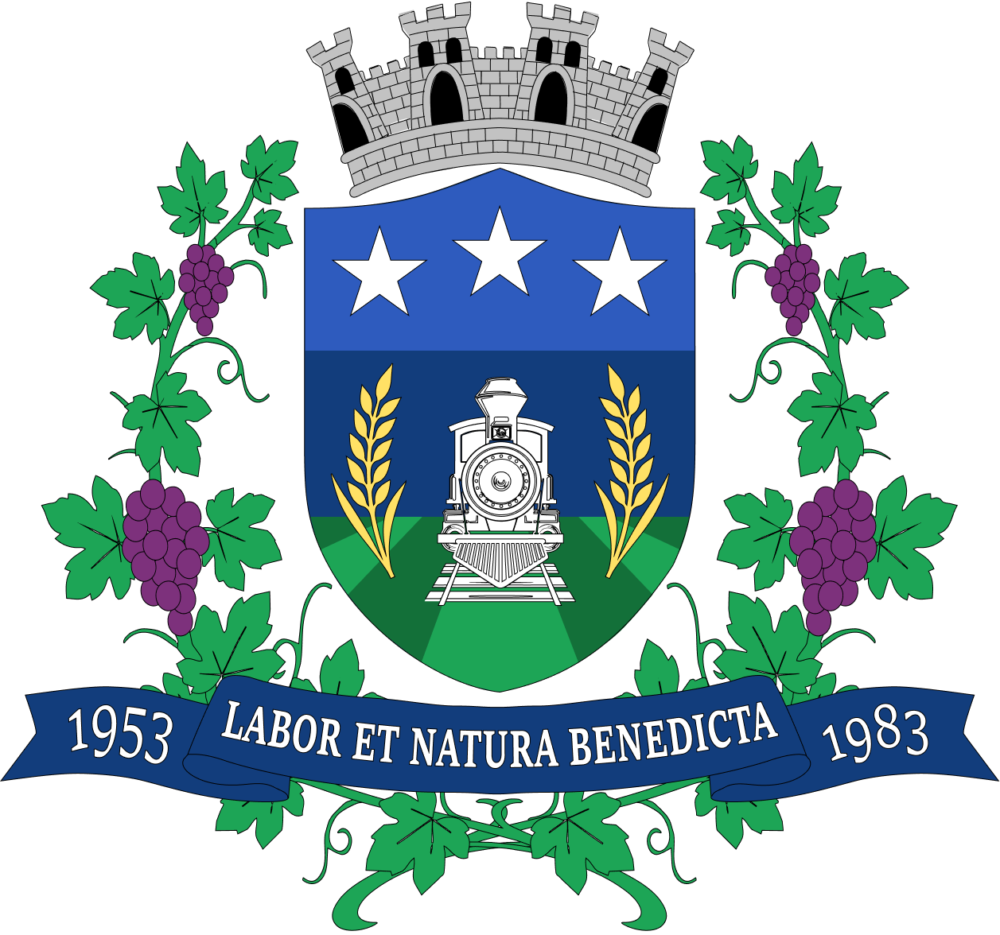
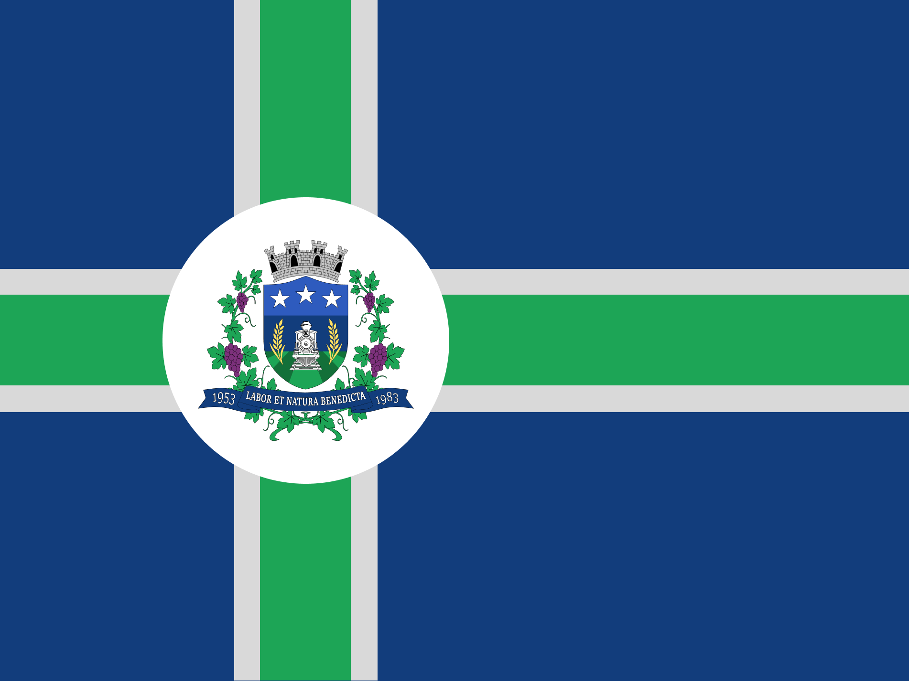
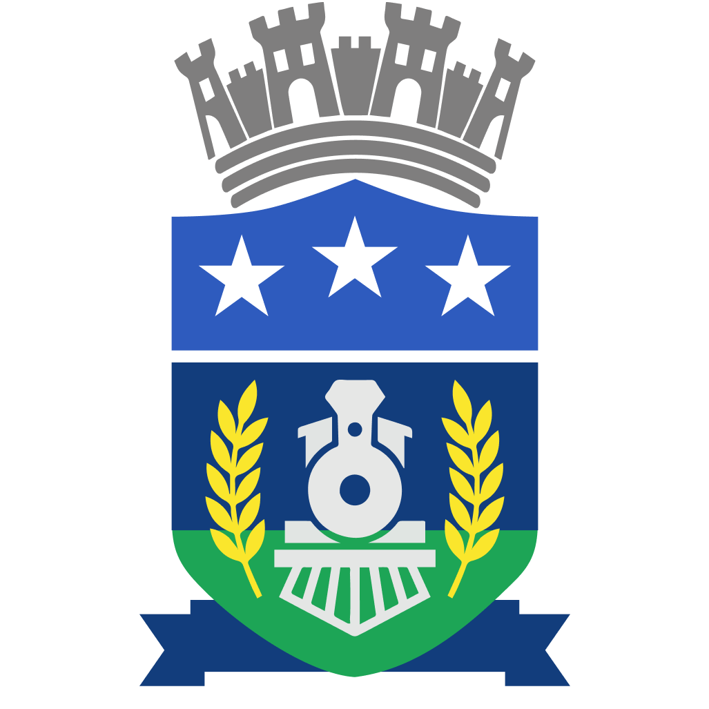

# 🛡️ Símbolos Municipais de Ivaitá — SP

<p align="center">
  
</p>

<p align="center">
  <strong>Heráldica, vexilologia e representação institucional do Município de Ivaitá.</strong>
</p>

Os símbolos municipais constituem uma das principais expressões visuais da identidade de **Ivaitá-SP**.

O **Brasão de Armas** e a **Bandeira Municipal** sintetizam elementos da história, do território, da agricultura, da ferrovia e da memória cívica ivaitense.

Esta pasta reúne as representações canônicas utilizadas no projeto.

> **Os símbolos apresentados nesta coleção fazem parte do cânone visual de Ivaitá e não devem ser redesenhados ou reinterpretados arbitrariamente.**

---

# 🛡️ Brasão de Armas

<p align="center">
  <a href="brasao-municipal.png">
    
  </a>
</p>

<p align="center">
  <a href="brasao-municipal.png"><strong>🔎 Ver brasão em tamanho completo</strong></a>
</p>

O **Brasão de Armas de Ivaitá** funciona como uma síntese heráldica da formação histórica do município.

Sua composição reúne referências ao **civismo, à agricultura, à viticultura, à ferrovia e à preservação da memória municipal**.

---

## 📜 Blasonamento Heráldico

> Um escudo samnítico, tendo em chefe campo de blau, carregado de três estrelas de cinco pontas de argente, postas em faixa. O campo inferior apresenta céu de blau, horizonte de sable e campanha de sinopla, disposta em perspectiva heráldica.
>
> Brocante sobre o centro do campo, a representação da locomotiva a vapor nº 42, vista de frente, em sable e argente, assentada sobre trilhos de ferro que se prolongam até a ponta do escudo.
>
> Flanqueando a locomotiva, duas espigas de trigo em pala, de ouro.
>
> Por suportes, dois ramos de videira, folheados de sinopla e frutados de cachos de púrpura, dispostos lateralmente e entrecruzados sob a ponta do escudo.
>
> Encimando o conjunto, coroa mural de argente, de quatro torres visíveis, com portas abertas de sable.
>
> Sob o escudo, listel de blau carregado, em letras de argente, da divisa latina **LABOR ET NATURA BENEDICTA**, ladeada pelas datas históricas **1953** e **1983**.

---

## ✦ Elementos do Brasão

| Elemento | Significado |
| --- | --- |
| ⭐ **Três estrelas** | Harmonia institucional, equilíbrio e continuidade cívica |
| 🚂 **Locomotiva nº 42** | Ferrovia, trabalho, desenvolvimento e preservação da memória |
| 🛤️ **Trilhos** | Caminho, integração e continuidade |
| 🌾 **Trigo** | Formação agrícola e trabalho da terra |
| 🍇 **Videiras** | Viticultura, Alto dos Vinhedos e famílias produtoras |
| 🏰 **Coroa mural** | Caráter municipal e representação da cidade |
| 📜 **Listel** | Lema e marcos históricos do município |

---

## ⭐ As três estrelas

As três estrelas de cinco pontas representam simbolicamente a harmonia entre **Executivo, Legislativo e Judiciário**, além dos valores de equilíbrio e continuidade cívica.

A representação é simbólica e não implica a existência de um Poder Judiciário municipal próprio.

Na tradição popular, as estrelas também foram relacionadas a três luzes observadas sobre as serras no início da década de 1980.

Dessa memória surgiu a expressão:

> **“Três luzes sobre a serra, boa uva e paz na terra.”**

A interpretação popular convive com o significado institucional sem substituí-lo.

---

## 🚂 Locomotiva nº 42

A **Locomotiva nº 42** representa um dos principais elementos da memória ferroviária de Ivaitá.

Originalmente associada à pequena ferrovia de **bitola estreita de 60 cm**, utilizada no transporte de trabalhadores e produtos agrícolas, a locomotiva posteriormente tornou-se patrimônio histórico.

Sua preservação e restauração em 1983 transformaram a nº 42 em símbolo da relação de Ivaitá com seu passado ferroviário.

Hoje ela também está associada à ferrovia histórica e turística do município.

---

## 🌾 Agricultura e Viticultura

As espigas de trigo representam a importância histórica da agricultura na formação de Ivaitá.

As videiras estabelecem relação direta com o **Alto dos Vinhedos**, com as famílias produtoras e com a tradição vitivinícola que posteriormente daria origem a manifestações culturais como a **Festa da Vindima**.

---

## 📜 Divisa Municipal

O listel apresenta a expressão:

> **LABOR ET NATURA BENEDICTA**

Traduzida como:

> **Trabalho e Natureza Abençoados**

A divisa sintetiza duas forças fundamentais da formação de Ivaitá:

```text
LABOR
trabalho humano
        +
NATURA
território e natureza
        ↓
IVAITÁ
```

---

## 📅 1953 · 1983

As duas datas presentes no brasão representam momentos distintos da história municipal.

**1953** marca a emancipação político-administrativa de Ivaitá, ocorrida em **31 de dezembro de 1953**.

**1983** representa o período de reafirmação e preservação da memória ferroviária, associado à Estação Santa Vitória, à restauração da Locomotiva nº 42 e à consolidação de elementos da identidade cívica municipal.

---

# 🚩 Bandeira Municipal

<p align="center">
  <a href="bandeira-municipal.png">
    
  </a>
</p>

<p align="center">
  <a href="bandeira-municipal.png"><strong>🔎 Ver bandeira em tamanho completo</strong></a>
</p>

A **Bandeira Municipal de Ivaitá** traduz a identidade do município através de uma composição vexilológica mais sintética.

Enquanto o brasão concentra diferentes elementos históricos, a bandeira trabalha principalmente com **geometria, cor e reconhecimento à distância**.

Sua proporção oficial é:

> **14:20**

---

## 📐 Descrição Vexilológica

> Bandeira retangular, de proporção oficial **14:20**, apresentando campo de blau, esquartelado por cruz de inspiração nórdica deslocada em direção à tralha, composta por faixa de sinopla perfilada de argente.
>
> Brocante ao cruzamento das faixas, figura um besante de argente, carregado em seu centro com o Brasão de Armas do Município de Ivaitá, representado em seus esmaltes, metais e cores próprias.

---

## 🎨 Simbolismo da Bandeira

| Elemento | Significado |
| --- | --- |
| 🔵 **Blau** | Civismo, serenidade, céu e águas |
| 🟢 **Sinopla** | Terra, agricultura, natureza e Alto dos Vinhedos |
| ⚪ **Argente** | Paz, integridade e caminhos |
| ⚪ **Besante central** | Unidade e centralidade municipal |
| 🛡️ **Brasão** | História e memória de Ivaitá |

Os filetes brancos que acompanham a faixa verde também permitem uma leitura relacionada aos **trilhos e caminhos que participaram da formação do município**.

---

## 🧭 Estrutura da Bandeira

A cruz possui inspiração nórdica e encontra-se **deslocada em direção à tralha**, característica fundamental da composição.

Essa assimetria contribui para a identidade visual da bandeira e não deve ser eliminada em reproduções.

A leitura simbólica pode ser resumida como:

```text
AZUL
céu + águas + civismo

        +

VERDE
terra + agricultura + natureza

        +

BRANCO
paz + caminhos + ferrovia

        +

BRASÃO
história + memória

        ↓

IVAITÁ
```

---

# 🔷 Favicon de Ivaitá

<p align="center">
  <a href="favicon-ivaita.png">
    
  </a>
</p>

<p align="center">
  <a href="favicon-ivaita.png"><strong>🔎 Ver favicon em tamanho completo</strong></a>
</p>

O **favicon de Ivaitá** é uma aplicação destinada ao ambiente digital.

Sua função é representar visualmente a Plataforma Digital de Ivaitá em contextos de pequena escala, como:

- abas do navegador;
- favoritos;
- atalhos;
- aplicações web;
- interfaces digitais.

Diferentemente do brasão e da bandeira, o favicon deve ser entendido como um **ativo da identidade digital**, e não como um terceiro símbolo cívico oficial do município.

Essa distinção preserva a hierarquia institucional:

```text
SÍMBOLOS MUNICIPAIS
├── Brasão de Armas
└── Bandeira Municipal

IDENTIDADE DIGITAL
└── Favicon
```

---

# 🎨 Heráldica e identidade contemporânea

Os símbolos históricos servem como uma das bases para o desenvolvimento da identidade visual contemporânea de Ivaitá.

A paleta institucional principal inclui:

| Cor | Hexadecimal |
| --- | --- |
| 🔵 Azul principal | `#123D7C` |
| 🔷 Azul secundário | `#2E5BBE` |
| 🟢 Verde | `#1DA556` |
| 🌲 Verde escuro | `#137039` |
| 🟣 Roxo | `#7D317C` |

Essas cores permitem que a identidade seja reconhecida em **comunicação, sinalização, transporte, interfaces, campanhas e serviços** sem exigir a utilização constante do brasão.

> **O brasão é um símbolo da identidade. A identidade visual é um sistema maior que o brasão.**

---

# 📏 Integridade dos Símbolos

Brasão e bandeira são elementos canônicos e devem preservar suas características fundamentais.

### O brasão deve preservar

- escudo;
- três estrelas;
- Locomotiva nº 42;
- trilhos;
- espigas de trigo;
- videiras;
- coroa mural;
- listel;
- lema;
- datas históricas.

### A bandeira deve preservar

- proporção **14:20**;
- campo azul;
- cruz deslocada em direção à tralha;
- faixa verde;
- filetes brancos;
- círculo central;
- Brasão de Armas.

Não integram a linguagem oficial:

- distorções;
- alteração arbitrária das cores;
- reorganização dos elementos;
- efeitos tridimensionais;
- gradientes não previstos;
- substituição do brasão;
- mudança das proporções fundamentais.

Versões simplificadas, reduzidas ou monocromáticas devem fazer parte de um sistema formal de identidade, e não ser improvisadas para aplicações específicas.

---

## ⚠️ Sobre os símbolos

**Ivaitá-SP é uma cidade fictícia.**

O Brasão de Armas, a Bandeira Municipal e os demais elementos apresentados nesta coleção foram desenvolvidos como parte de um projeto de **identidade visual, heráldica, vexilologia, worldbuilding e design institucional**.

Os símbolos pertencem ao universo ficcional de Ivaitá e não representam qualquer município real.

---

<p align="center">
  <strong>Ivaitá — SP</strong><br>
  História transformada em símbolo.
</p>

<p align="center">
  <a href="../README.md"><strong>← Voltar ao Projeto Ivaitá</strong></a>
  &nbsp;·&nbsp;
  <a href="https://ivaita-portal.pages.dev/"><strong>🌐 Plataforma Digital</strong></a>
</p>
